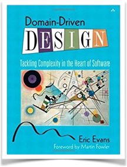
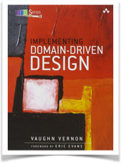
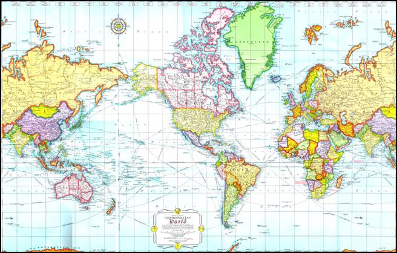

# Domain-Driven Design
## Tackling Complexity in the Heart of Software
---
# What Is DDD? 
+++
> Domain-driven design (__DDD__) is an __approach to developing software__ for complex needs by deeply connecting the implementation to an evolving __model of the core business__ 
+++
# What?

+++
* A set of __strategic and tactical modeling tools__ necessary to design high-quality software that meets core business objectives
* __Not__ a specific technology
---
## The Books

+++

### [Domain-Driven Design](http://a.co/8jJlMNF)
#### Eric Evans
#### 2003
+++
(http://a.co/dNl1Mxg)
### [Implementing Domain-Driven Design](http://a.co/8jJlMNF)
#### Vaughn Vernon
#### 2013
+++
Mercator Map

---

The End :)

http://a.co/8jJlMNF